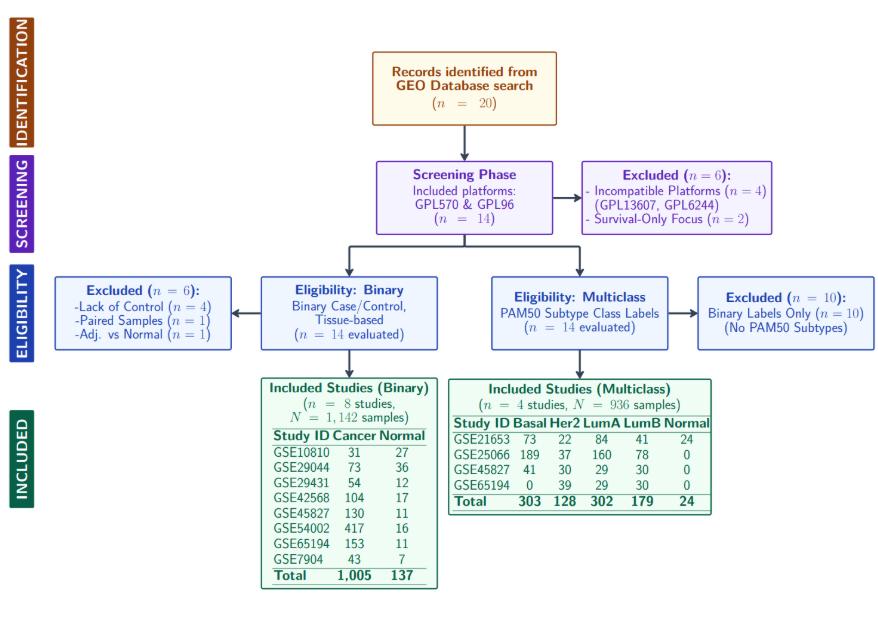
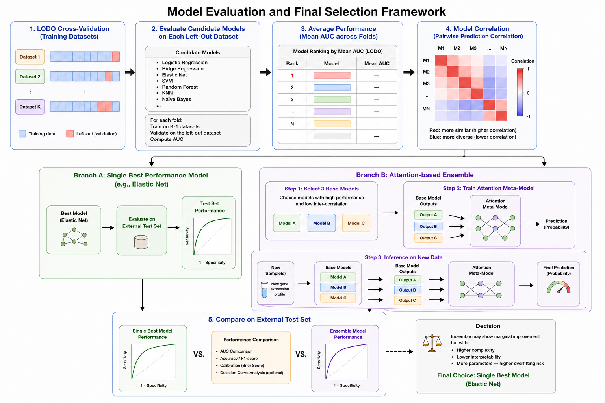

```{r setup}
#| include: false
#| message: false
#| warning: false

library(tidyverse)
library(ggplot2)
library(patchwork)
library(forcats)

binary_results <- "RDS_Files/binary"
mc_results     <- "RDS_Files/multiclass"
```

# Executive Summary

Breast cancer diagnosis relies on pathology and molecular testing, which can delay treatment by up to two weeks. This project investigated whether gene expression data could provide rapid estimates of cancer risk and PAM50 subtype to support clinical decision-making during this period.

Using Gene Expression Omnibus microarray datasets (@fig-prisma), two machine learning models were developed: a binary classifier for tumour versus normal tissue and a multiclass PAM50 subtype classifier. Models were evaluated using leave-one-dataset-out validation with batch correction to assess generalisability (@fig-overview).

On an external dataset, the binary model achieved AUC 0.97 and sensitivity 0.95 (@fig-binary), while the multiclass model achieved balanced accuracy 0.70 (@fig-multiclass). A Shiny application (<https://data3888-group28.shinyapps.io/RiskCalculator-UI-DEMO/>) was deployed to enable clinicians to obtain rapid risk and subtype predictions with uncertainty estimates (@fig-shiny).

# Background and Aim

Breast cancer is the most commonly diagnosed cancer in women worldwide, with approximately 2.3 million new cases annually [@sung2021global]. After a suspicious lesion is detected on imaging, a biopsy is performed and reviewed by a specialist pathologist. Complete pathology reports, including hormone receptor and HER2 status that guide treatment, may take up to two weeks [@bcna2021pathology]. This delay creates a bottleneck in clinical decision-making, particularly in settings with limited resources or high diagnostic demand. In addition, diagnostic agreement between pathologists can vary, especially for borderline cases [@elmore2015diagnostic].

Beyond distinguishing malignant from normal tissue, breast cancers are biologically diverse and can be classified into molecular subtypes using the PAM50 framework: Luminal A, Luminal B, HER2-enriched, Basal-like, and Normal-like [@perou2000molecular; @parker2009supervised]. These subtypes have distinct prognostic and treatment implications. Gene expression profiling captures these molecular patterns and enables systematic computational analysis. Large-scale public repositories such as the Gene Expression Omnibus (GEO) provide curated, multi-institutional breast cancer datasets with clinical labels [@edgar2002gene], offering an opportunity to develop predictive models that support earlier clinical insight during the diagnostic window.

**Aim**

This project applies machine learning to gene expression data to address delays in breast cancer diagnosis. The aims are:

1. To develop a binary classifier that distinguishes tumour from normal breast tissue using gene expression data.
2. To develop a multiclass classifier that predicts PAM50 molecular subtypes, including Luminal A, Luminal B, HER2-enriched, Basal-like, and Normal-like, for patients identified as higher risk.
3. To evaluate both models for generalisability across independent datasets and provide rapid, interpretable predictions to support clinical decision-making while awaiting definitive pathology results.

# Methods

## Part A -- Pipeline

### Data Collection and Preprocessing Pipeline

Twenty publicly available breast cancer microarray datasets were identified from GEO and screened for platform compatibility, retaining only Affymetrix GPL570 and GPL96 arrays to ensure a consistent probe architecture. All datasets were required to derive from primary breast tissue biopsies. Six datasets were excluded for incompatible platforms or survival-only focus, leaving 14 candidates evaluated under two parallel eligibility tracks (@fig-prisma). For binary classification, eight datasets met the requirement for genuine tissue-based cancer vs. normal labels (N = 1,142; 1,005 cancer, 137 normal): GSE10810 [@geo_gse10810], GSE29044 [@geo_gse29044], GSE29431 [@geo_gse29431], GSE42568 [@geo_gse42568], GSE45827 [@geo_gse45827], GSE54002 [@geo_gse54002], GSE65194 [@geo_gse65194], and GSE7904 [@geo_gse7904]; six were excluded for lacking healthy controls, containing only paired adjacent-tumour samples, or using adjacent-tumour as the reference. For PAM50 multiclass classification, four datasets with annotated subtype labels were retained (N = 936; Basal n = 303, Her2 n = 128, LumA n = 302, LumB n = 179, Normal n = 24): GSE21653 [@geo_gse21653], GSE25066 [@geo_gse25066], GSE45827 [@geo_gse45827], and GSE65194 [@geo_gse65194]; ten lacked subtype annotations entirely.

```{r fig-prisma}
#| label: fig-prisma
#| fig-cap: "PRISMA-style dataset selection flow diagram. Twenty GEO datasets were screened; 8 were retained for binary classification and 4 for PAM50 multiclass classification."
#| echo: false
#| out-width: "85%"


```

Both the binary and multiclass classifiers were developed under a common framework. The following subsections describe only where each task departs from it.

Both were evaluated using leave-one-dataset-out (LODO) cross-validation, in which one entire dataset is held out as the test fold while the remainder are used for training. This treats each study as an independent cohort and approximates prospective deployment on an unseen site, rather than rewarding within-study memorisation. Both used a panel-size sweep across top-N gene sets to balance classification performance against clinically feasible assay size. The overall modelling workflow is shown in @fig-overview.

```{r fig-overview}
#| label: fig-overview
#| fig-cap: "Methods overview: end-to-end pipeline from GEO data collection through preprocessing, LODO model training, external validation, and Shiny deployment."
#| echo: false
#| out-width: "100%"


```

**Metrics Used:**

- **Sensitivity (recall):** the proportion of patients that the model correctly identifies.
- **Specificity:** the proportion of patients not of that class that are correctly ruled out.
- **Balanced accuracy:** the average sensitivity across all subtypes, giving each equal weight.
- **AUC:** measures how well the model's probabilities rank true cases above non-cases, independent of any decision threshold.

### A.1 Binary Classifier

**A.1.1 Model Selection.** Multiple classifiers were evaluated using LODO cross-validation, including Logistic Regression, Ridge, Elastic Net, SVM, Random Forest, KNN, and Naive Bayes. Models were ranked by mean AUC across validation folds, with balanced accuracy used as a secondary criterion when AUC values were similar to prioritise stability under dataset imbalance. An attention-based ensemble framework was also explored, with details provided in the Appendix. The overall workflow is shown in @fig-overview.

**A.1.2 Sweep for Optional Top Genes.** To balance predictive performance with potential clinical deployment cost and assay feasibility, relatively compact targeted gene panels (10 to 200 genes) were evaluated, reflecting clinically realistic NanoString-style assay sizes. Balanced accuracy was compared across different panel sizes to assess the trade-off between classification performance and practical clinical implementation.

**A.1.3 Output.** The classifier outputs P(Cancer) for each patient using a 0.5 decision threshold. Prediction confidence was defined as the maximum class probability. The main risk score shown for each patient is generated by the selected final model trained on the complete non-resampled training datasets. To estimate patient-level prediction uncertainty, the final model was refit 100 times using bootstrap resamples of the training data. Due to substantial class imbalance, equal numbers of Cancer and Normal samples were drawn in each iteration to improve prediction stability, particularly for the Normal class. These bootstrap models generated 100 predicted cancer probabilities per patient, from which probability ranges and confidence bands were derived. A separate bootstrap procedure was applied at the evaluation level by repeatedly resampling the external test datasets to estimate uncertainty for AUC, sensitivity, precision, balanced accuracy, and F1-score.

**A.1.4 External Validation.** The binary classifier was evaluated on a fully withheld external test dataset. GSE29044 [@geo_gse29044] was selected as the external testing dataset because it provided the most sufficient class distribution for evaluation, containing 73 Cancer samples and 36 Normal samples.

### A.2 Multiclass Classifier

**A.2.1 Multiclass Label Caveat.** Normal-like samples originate exclusively from GSE21653 [@geo_gse21653], meaning LODO performance metrics for this subtype are unreliable and should not be interpreted as a valid generalisation estimate. The deployed model, trained on these samples, remains capable of predicting this subtype prospectively.

**A.2.2 Model Selection.** 19 models, including weighted variations and ensembling, were evaluated. Metrics are computed in a one-vs-rest (OvR), macro-averaged form. Model selection prioritised mean balanced accuracy as the primary criterion. AUC, while able to identify good models, was excluded as a selection criterion because it saturates under clear class separation and is uninformative for identifying the best model. Balanced accuracy directly reflects per-class recall under class imbalance and is thus more suitable. Random Forest was excluded as its non-winning class probabilities are uninformative, degrading the clinical utility of the full probability vector output. kNN was excluded since predicted probabilities are restricted to multiples of 1/k, rendering the probability vector clinically uninterpretable. The winning model will then be hyperparameter-tuned to maximise performance.

**A.2.3 Output.** The classifier outputs a probability for each subtype per patient. The predicted subtype is the one with the largest probability, and that largest probability is taken as the prediction confidence. Bootstrap CIs (B = 200 training resamples, fixed hyperparameters) provide per-patient 95% probability ranges, defined as the 2.5th and 97.5th percentiles across 200 refitted predictions. Patients are assigned high- (>=0.70), moderate- (>=0.50), or low-confidence (<=0.50) bands based on prediction probability thresholds, where low-confidence cases are flagged for mandatory pathology review.

**A.2.4 Sweep for Optional Top Genes.** For multiclass, a panel-sized sweep across 5 to 50 genes per class was conducted, evaluating each panel size on balanced accuracy and high-confidence prediction percentage. High-confidence rate was included because a clinically deployed classifier must not only be accurate but also produce clinically actionable predictions. The deployed panel is determined by a single selection pass on the full batch-corrected dataset, yielding a fixed gene list independent of fold assignments. This directly informs the number of probes required for a potential NanoString assay.

## Part B -- Specific to Biomed

Samples were filtered to retain primary breast tissue only, excluding non-relevant samples such as cell lines (e.g. MCF-7), blood-derived samples (e.g. PBMC), and off-target tissues (e.g. colon) using metadata keyword matching. Class labels were assigned using a custom inference pipeline to resolve inconsistent GEO annotations. The most informative metadata fields were prioritised, with regex-based parsing used to assign Cancer or Normal labels for binary datasets and PAM50 subtypes for multiclass datasets. Ambiguous samples were resolved using keyword fallback (e.g. "tumour", "normal"), and unresolved cases were excluded. The Basal-like subtype includes triple-negative breast cancer, which overlaps with Basal-like tumours by ~70-80% and is clinically treated equivalently.

Expression data were log2-transformed when required, identified via a 99th percentile threshold (>50). Probes were mapped to HGNC symbols and collapsed to gene-level expression using averaging (`limma::avereps`), yielding 11,488 shared genes. Within each leave-one-dataset-out fold, ComBat (`sva`) batch correction was applied only to training data to prevent test leakage [@johnson2007adjusting]. Differential expression analysis (`limma`) was then performed within each training fold, with p-values adjusted using the Benjamini--Hochberg procedure [@ritchie2015limma]. Genes were ranked by adjusted p-value and effect size, and used to define candidate gene panels for the 5-50 gene sweep in Part A, ensuring a fixed feature set independent of test folds and supporting NanoString-style assay design. Each dataset was independently quantile-normalised using `limma::normalizeBetweenArrays`.

# Results

## Part A -- The Model

### Binary Classifier

**A.1.1 Binary Model Selection Performance.** Among all evaluated classifiers, Elastic Net achieved the highest overall ranking, with a mean LODO AUC of 0.9869. Based on these results, Elastic Net was selected as the final single best model for deployment in the binary risk calculator.

**A.1.2 Gene Panel.** The top 50 genes were ultimately selected, achieving strong balanced accuracy (0.875) while maintaining relatively low extraction and assay costs for potential clinical deployment.

**A.1.3 Lambda Optimisation.** Lambda was selected using stratified five-fold cross-validation within `cv.glmnet`. For each training set, the optimal value was defined as `lambda.min`, corresponding to the lambda that achieved the best cross-validated AUC. In the final Elastic Net model, this procedure resulted in 31 non-zero gene coefficients (excluding the intercept), indicating that the penalty retained only the most informative genes for discriminating Cancer from Normal.

**A.1.4 External Testing Performance.** The selected single best model (Elastic Net) and the previously trained ensemble model were evaluated on the independent external testing dataset. The Elastic Net classifier achieved an AUC of 0.97, balanced accuracy of 0.88, sensitivity of 0.95, and specificity of 0.80. The ensemble model achieved a similar AUC of 0.97, with improved balanced accuracy (0.95) and specificity (0.97), but slightly lower sensitivity (0.93). Although the ensemble model provided a modest improvement in overall balanced performance, sensitivity was prioritised due to the clinical importance of minimising missed cancer cases. In addition, the ensemble framework introduced greater complexity and reduced interpretability. Therefore, the Elastic Net model was selected as the final deployed binary classifier.

**A.1.5 Uncertainty Quantification.** Bootstrap resampling demonstrated stable predictive performance for the final Elastic Net classifier. For the selected top-50 gene panel, the bootstrap mean AUC was 0.976 (95% CI: 0.939--0.995), while balanced accuracy remained stable at 0.876 (95% CI: 0.820--0.931). Sensitivity also remained consistently high across resampling iterations, with a bootstrap mean of 0.945 (95% CI: 0.890--0.986). These results suggest that the classifier is robust to sampling variability and maintains stable cancer detection performance across bootstrap resamples.

```{r fig-binary}
#| label: fig-binary
#| fig-cap: "Binary classifier results. **(A)** LODO model comparison by AUC; Elastic Net (orange) selected. **(B)** Gene panel sweep showing balanced accuracy vs. panel size (mean +/- SD, 100 bootstrap resamples). **(C)** Confusion matrix on external test set GSE29044."
#| message: false
#| warning: false
#| fig-width: 14
#| fig-height: 12

lodo_metric_tbl          <- readRDS(file.path(binary_results, "lodo_metric_tbl_binary.rds"))
top_gene_elastic_results <- readRDS(file.path(binary_results, "top_gene_elastic_boot_long_binary.rds"))
elastic_external_cm_df   <- readRDS(file.path(binary_results, "elastic_external_cm_df_binary.rds"))
auc_tbl                  <- readRDS(file.path(binary_results, "auc_tbl_binary.rds"))

# Panel A: model comparison
pa_df <- lodo_metric_tbl %>%
  arrange(desc(AUC)) %>%
  mutate(is_best = model == "ElasticNet", label = model)

pa <- ggplot(pa_df, aes(x = AUC, y = fct_reorder(label, AUC),
                        colour = is_best, size = is_best)) +
  geom_point() +
  geom_text(data = ~filter(.x, is_best),
            aes(label = sprintf("AUC = %.3f", AUC)),
            nudge_y = 0.4, fontface = "bold", size = 3.8, colour = "#E87722") +
  geom_vline(xintercept = 0.95, linetype = "dashed", colour = "grey60", linewidth = 0.5) +
  scale_colour_manual(values = c("TRUE" = "#E87722", "FALSE" = "grey60")) +
  scale_size_manual(values   = c("TRUE" = 5, "FALSE" = 3)) +
  scale_x_continuous(limits  = c(0.85, 1.02)) +
  theme_bw(base_size = 11) +
  labs(title = "(A) LODO Model Comparison", x = "LODO AUC", y = NULL) +
  theme(legend.position = "none", panel.grid.minor = element_blank())

# Panel B: gene panel sweep
pb <- top_gene_elastic_results %>%
  pivot_longer(cols = c(AUC, BalancedAccuracy),
               names_to = "Metric", values_to = "Value") %>%
  mutate(TopGenesLabel = factor(paste0("Top ", TopGenes),
                                levels = paste0("Top ", sort(unique(TopGenes))))) %>%
  filter(Metric == "BalancedAccuracy") %>%
  group_by(TopGenesLabel, TopGenes) %>%
  summarise(mean_val = mean(Value, na.rm = TRUE),
            sd_val   = sd(Value,   na.rm = TRUE), .groups = "drop") %>%
  ggplot(aes(x = TopGenesLabel, y = mean_val, group = 1)) +
  geom_ribbon(aes(ymin = mean_val - sd_val, ymax = mean_val + sd_val),
              fill = "#2166AC", alpha = 0.15) +
  geom_line(colour = "#2166AC", linewidth = 1.1) +
  geom_point(size = 3.5, colour = "#2166AC") +
  geom_text(aes(label = sprintf("%.3f", mean_val)), vjust = -0.9, size = 3.2, fontface = "bold") +
  scale_y_continuous(limits = c(0.4, 1.0)) +
  theme_bw(base_size = 11) +
  labs(title    = "(B) Gene Panel Sweep -- Balanced Accuracy (External Test)",
       subtitle = "Mean +/- SD across 100 bootstrap resamples",
       x = "Number of top genes", y = "Balanced Accuracy") +
  theme(panel.grid.minor = element_blank())

# Panel C: confusion matrix
pc <- ggplot(elastic_external_cm_df, aes(x = Predicted, y = Truth, fill = Freq)) +
  geom_tile(color = "white", linewidth = 0.8) +
  geom_text(aes(label = Label), size = 4.5, fontface = "bold") +
  scale_fill_gradient(low = "#F7FBFF", high = "#2C7FB8", name = "Count") +
  theme_minimal(base_size = 11) +
  theme(panel.grid = element_blank(), plot.title = element_text(face = "bold")) +
  labs(title = "(C) Confusion Matrix -- Elastic Net on GSE29044",
       x = "Predicted label", y = "True label")

(pa | pb) / pc + plot_layout(heights = c(1, 0.8))
```

### Multiclass Classifier

**A.2.1 Multiclass Model Performance.** The top models were penalised multinomial regression models: ElasticNet, Ridge, and Lasso. ElasticNet was selected as it combines L1 sparsity with L2 stability, performing best on balanced accuracy (0.704 vs Ridge's 0.683 and Lasso's 0.694) while maintaining competitive AUC. Non-regression approaches performed consistently worse. The stacked ensemble produced no improvement over the single best model, confirming that the additional complexity was not justified.

**A.2.2 Lambda Optimisation.** Similar to binary, lambda was selected via 10-fold cross-validation in `cv.glmnet`, with alpha fixed at 0.5 after comparing Lasso (alpha = 1) and Ridge (alpha = 0). The number of non-zero coefficients (130) at `lambda.min` confirms the model retains only the most discriminative genes per subtype contrast.

**A.2.3 Gene Panel.** The panel size sweep across 5 to 50 genes per class revealed that AUC plateaued rapidly across panel sizes (approximately 0.93). In contrast, balanced accuracy and high-confidence predictions continued to improve. Thus, the top 50 genes per class were selected. The final model takes 207 unique genes as input. Inter-class overlap was extremely limited, with most subtypes sharing fewer than 10 genes, confirming largely distinct transcriptional programmes per subtype. Top-ranked genes were biologically coherent with known PAM50 biology: ERBB2 and GRB7 for HER2, ESR1 and GATA3 for the Luminal subtypes, and loss of luminal marker expression for Basal/TNBC [@slamon1987human; @perou2000molecular].

**A.2.4 Per-Class Sensitivity and Specificity.** Evaluated on a stratified hold-out set, the model achieved an 88.7% bootstrap mean accuracy and a 91.1% median predicted confidence. Subtype-level performance varied: Luminal A and B sensitivity were similar, with high specificity. Basal/TNBC showed perfect specificity (1.000) but sensitivity of only 0.427, attributable in part to data imbalance. HER2 achieved the highest sensitivity (0.898), though specificity was moderate (0.687), reflecting spillover predictions into the HER2 class from mostly Basal/TNBC. This is consistent with known transcriptional overlap [@cheang2009ki67], yet it is still the main limitation of the classifier.

**A.2.5 Uncertainty Quantification.** The 91.1% median predicted confidence has a mean bootstrap 95% CI width of 24.1%, indicating moderate uncertainty in predicted subtype probabilities. Of 256 hold-out patients, 196 (77%) received a high-confidence classification, and 22 (9%) were flagged as low-confidence for clinical review. Model disagreement analysis confirmed that incorrectly classified samples cluster at lower confidence values, validating the confidence score as a clinically meaningful signal for flagging ambiguous cases.

```{r fig-multiclass}
#| label: fig-multiclass
#| fig-cap: "Multiclass PAM50 classifier results. **(A)** Model comparison by balanced accuracy; ElasticNet (orange) selected. **(B)** Gene panel sweep showing balanced accuracy and high-confidence rate vs. panel size. **(C)** Pooled LODO confusion matrix (Normal-like excluded; row-normalised)."
#| message: false
#| warning: false
#| fig-width: 14
#| fig-height: 13

lodo_perf  <- readRDS(file.path(mc_results, "lodo_perf_multiclass.rds"))
ba_summary <- readRDS(file.path(mc_results, "ba_summary_multiclass.rds"))
best_mc    <- readRDS(file.path(mc_results, "best_model_mc_multiclass.rds"))
preds_best <- readRDS(file.path(mc_results, "preds_best_multiclass.rds"))
all_lvls   <- readRDS(file.path(mc_results, "all_lvls_multiclass.rds"))
sweep_v2   <- readRDS(file.path(mc_results, "gene_sweep_correctedv4.rds"))

# Panel A: model comparison
mc_summary <- lodo_perf %>%
  group_by(model) %>%
  summarise(mcc_mean = mean(mcc, na.rm = TRUE),
            auc_mean = mean(macro_auc, na.rm = TRUE), .groups = "drop") %>%
  left_join(ba_summary %>% select(model, ba_mean), by = "model") %>%
  arrange(desc(ba_mean), desc(mcc_mean)) %>%
  mutate(is_best = model == best_mc, label = model)

pa_mc <- ggplot(mc_summary,
                aes(x = ba_mean, y = fct_reorder(label, ba_mean),
                    colour = is_best, size = is_best)) +
  geom_point() +
  geom_text(data = ~filter(.x, is_best),
            aes(label = sprintf("BA = %.3f", ba_mean)),
            nudge_y = 0.4, fontface = "bold", size = 3.8, colour = "#E87722") +
  geom_vline(xintercept = 0.7, linetype = "dashed", colour = "grey60", linewidth = 0.5) +
  scale_colour_manual(values = c("TRUE" = "#E87722", "FALSE" = "grey60")) +
  scale_size_manual(values   = c("TRUE" = 5, "FALSE" = 3)) +
  theme_bw(base_size = 11) +
  labs(title = "(A) Multiclass Model Comparison", x = "Balanced Accuracy (LODO mean)", y = NULL) +
  theme(legend.position = "none", panel.grid.minor = element_blank())

# Panel B: gene panel sweep
sweep_summary <- bind_rows(lapply(sweep_v2, function(r) {
  if (is.null(r)) return(NULL)
  tibble::tibble(
    n_genes       = r$n_panel_genes,
    hold_ba       = r$hold_metrics$`Balanced Acc`,
    pct_high_conf = if (!is.null(r$risk_bands))
      round(100 * r$risk_bands["High confidence"] / sum(r$risk_bands), 1) else NA
  )
}))

pb_mc <- sweep_summary %>%
  pivot_longer(cols = c(hold_ba, pct_high_conf),
               names_to = "metric", values_to = "value") %>%
  mutate(metric = recode(metric,
    hold_ba       = "Balanced Accuracy (Hold-out)",
    pct_high_conf = "% High-confidence patients"),
    value_scaled  = if_else(grepl("High-confidence", metric), value / 100, value)) %>%
  ggplot(aes(x = n_genes, y = value_scaled, colour = metric, group = metric)) +
  geom_line(aes(linetype = grepl("High-confidence", metric)), linewidth = 1.1) +
  geom_point(size = 2.5) +
  scale_linetype_manual(values = c("TRUE" = "dashed", "FALSE" = "solid"), guide = "none") +
  scale_colour_manual(values = c("Balanced Accuracy (Hold-out)" = "#2166AC",
                                 "% High-confidence patients"   = "#35964F")) +
  theme_bw(base_size = 11) +
  labs(title    = "(B) Gene Panel Sweep -- Hold-out Performance",
       subtitle = "Dashed = high-confidence % (divided by 100 for scale)",
       x = "Total unique panel genes", y = "Score", colour = NULL) +
  theme(legend.position = "bottom", panel.grid.minor = element_blank())

# Panel C: confusion matrix
display_lvls <- setdiff(all_lvls, "Normal-like")

cm_mc <- preds_best %>%
  dplyr::filter(!is.na(truth), truth != "", truth != "Normal-like") %>%
  mutate(truth = factor(truth, levels = display_lvls),
         pred  = factor(pred,  levels = display_lvls)) %>%
  dplyr::count(truth, pred) %>%
  tidyr::complete(truth, pred, fill = list(n = 0)) %>%
  group_by(truth) %>%
  mutate(pct = n / sum(n)) %>%
  ungroup()

pc_mc <- ggplot(cm_mc, aes(x = pred, y = fct_rev(truth), fill = pct)) +
  geom_tile(colour = "white", linewidth = 0.8) +
  geom_text(aes(label  = if_else(n > 0, sprintf("%d\n(%.0f%%)", n, pct * 100), "0"),
                colour = pct > 0.5), size = 3.5, fontface = "bold") +
  scale_fill_gradientn(colours = c("#FFFFFF", "#C6DBEF", "#2166AC"),
                       limits = c(0, 1), name = "Row %") +
  scale_colour_manual(values = c("FALSE" = "black", "TRUE" = "white"), guide = "none") +
  scale_x_discrete(position = "top") +
  theme_bw(base_size = 11) +
  theme(axis.text.x = element_text(angle = 30, hjust = 0), panel.grid = element_blank()) +
  labs(title    = paste0("(C) Confusion Matrix -- ", best_mc, " (Pooled LODO)"),
       subtitle = "Rows = true subtype; % = row-normalised recall",
       x = "Predicted subtype", y = "True subtype")

(pa_mc | pb_mc) / pc_mc + plot_layout(heights = c(1, 1.1))
```

## Part B -- The Shiny Application

The Shiny application was developed to translate the trained breast cancer classification models into an interactive patient-level risk calculator (<https://data3888-group28.shinyapps.io/RiskCalculator-UI-DEMO/>). Users can upload gene expression datasets in CSV, TXT, or GEO txt.gz format. The application automatically identifies patient profiles, maps probe identifiers to gene symbols when required, and performs quality checks to ensure that the uploaded data contain the genes required by the prediction model.

After a patient is selected, the final Elastic Net classifier generates a risk score between 0 and 1, together with a risk category and a 95% bootstrap confidence interval to indicate prediction uncertainty. For medium- and high-risk patients, a secondary multiclass model predicts the most likely molecular subtype and displays subtype probabilities, providing additional biological interpretation.

To improve clinician usability and interpretability, the dashboard was designed as a simplified and interactive interface with seven functional components (@fig-shiny): (1) Input/Upload, (2) Patient Selection and Options, (3) Main Risk Summary, (4) Molecular Subtype Assessment, (5) Gene Expression Visualisation, (6) Gene Expression Summary Table, and (7) Clinical Use Notes. These modules guide users from data upload and quality assessment through prediction and interpretation.

The dashboard also includes gene-expression visualisations that compare the selected patient with reference samples, allowing potentially abnormal biomarkers to be identified. In addition, key contributing genes and summary statistics are displayed to improve model transparency and support interpretation of prediction results.

The final application was deployed through shinyapps.io, enabling interactive access across devices and allowing users to explore prediction results in real time. This deployment demonstrates how machine-learning models can be translated into a practical clinical decision-support tool.

```{r fig-shiny}
#| label: fig-shiny
#| fig-cap: "Shiny application dashboard (<https://data3888-group28.shinyapps.io/RiskCalculator-UI-DEMO/>). Seven functional components guide the clinician from data upload through risk prediction, subtype classification, and gene-level interpretation."
#| echo: false
#| out-width: "100%"

knitr::include_graphics("images/fig_shiny.png")
```

# Discussion and Conclusion

## Conclusion

This project developed two machine learning models for breast cancer characterisation using gene expression data. The binary classifier achieved strong performance (AUC 0.97, sensitivity 0.95), prioritising sensitivity to reduce false negatives. The multiclass PAM50 model achieved moderate performance (balanced accuracy 0.70), performing better in common subtypes than in rarer or overlapping classes.

Key genes such as ERBB2 and ESR1 were recovered, supporting established subtype biology [@slamon1987human; @perou2000molecular]. Leave-one-dataset-out evaluation ensured cross-cohort assessment, while bootstrap uncertainty estimates enabled identification of low-confidence predictions. The models were deployed in a Shiny application providing rapid, interpretable decision support outputs.

## Discussion

Several limitations arise from data availability and biological complexity. Although the dataset includes over 900 tumour samples and approximately 100 normal samples across cohorts, it represents only part of global breast cancer diversity. This imbalance may reduce model stability despite resampling and balanced evaluation metrics. Principal component analysis showed strong tumour-normal separation within each dataset. This likely reflects true biological signal but may also have influenced gene selection, increasing apparent feature stability.

The multiclass task is constrained by uneven subtype representation. The Normal-like subtype appears in only one dataset, preventing full leave-one-dataset-out validation and limiting cross-cohort generalisability. Biologically, subtype prediction is more complex than tumour-normal classification. Reduced sensitivity in Basal/TNBC and overlap with HER2 reflect known transcriptional similarity between PAM50 subtypes rather than model error [@perou2000molecular; @cheang2009ki67].

## Future Work

Future work should focus on increasing representation of under-sampled subtypes, particularly Normal-like and Basal/TNBC, to improve robustness. Expanding normal samples is limited by clinical practice, as biopsies are only performed when disease is suspected. Methodological improvements include hierarchical classification and integration of clinical variables to better capture overlapping subtype structure. Prospective validation would be required for clinical translation, with extension to survival prediction aligning the framework with clinical outcomes [@parker2009supervised].

# Student Contributions {.unnumbered}

All six members identified candidate datasets from GEO and contributed to exploratory data analysis and report writing.

- **Rihan Wang** developed the back-end functionality of the Shiny application, ensuring model outputs were correctly processed and served to the interface, and was responsible for transitioning and organising the presentation slides.
- **Ant Le** built and evaluated the multiclass PAM50 subtype classification models, including model selection and performance assessment, and addressed technical and scientific questions during the group presentation.
- **Jing Meng** led the development of the project's background and aims, ensuring the scientific motivation was clearly articulated, and delivered this content during the group presentation.
- **Yang Chen** built and evaluated the binary cancer vs. normal classification models, including model tuning and performance benchmarking, and demonstrated the deployed Shiny application during the presentation.
- **Zilong Li** designed and implemented the front-end interface of the Shiny application, focusing on layout, usability, and visual presentation, and demonstrated the Shiny application during the group presentation.
- **Camila Calahorrano** led the data preprocessing pipeline, including sample filtering, label assignment, normalisation, and batch correction, and presented an overview of the modelling approach in the slides.

# References {.unnumbered}

::: {#refs}
:::

# Acknowledgements {.unnumbered}

We thank **Harry** and **Shreya** for their guidance, feedback, and support throughout this project. Generative AI tools (Claude by Anthropic) were used for assistance with code review and report editing. All analytical decisions, interpretations, and written content are the work of the authors.

# Appendix {.unnumbered}

## Appendix A -- Binary Model: Uncertainty Quantification

```{r appendix-binary-uncertainty}
#| fig-cap: "Elastic Net metric uncertainty on GSE29044 (top-50 gene panel). Points = point estimates; bars = 95% bootstrap percentile intervals (100 class-stratified resamples)."
#| message: false
#| warning: false
#| fig-width: 10
#| fig-height: 8

elastic_metric_summary <- tryCatch(
  readRDS(file.path(binary_results, "elastic_metric_summary_binary.rds")),
  error = function(e) NULL
)

if (!is.null(elastic_metric_summary)) {
  metric_labels <- c(
    AUC              = "AUC",
    Sensitivity      = "Sensitivity",
    Specificity      = "Specificity",
    BalancedAccuracy = "Balanced accuracy",
    F1               = "F1 score",
    NPV              = "NPV",
    Precision        = "Precision",
    MCC              = "MCC",
    Brier            = "Brier score"
  )
  plot_df <- elastic_metric_summary %>%
    filter(metric %in% names(metric_labels)) %>%
    mutate(metric_label = factor(unname(metric_labels[as.character(metric)]),
                                 levels = rev(unname(metric_labels))))
  ggplot(plot_df, aes(x = point_estimate, y = metric_label)) +
    geom_linerange(aes(xmin = ci_lower, xmax = ci_upper),
                   linewidth = 1.1, colour = "#4C78A8") +
    geom_point(size = 2.8, colour = "#E45756") +
    scale_x_continuous(limits = c(0, 1.05), breaks = c(0, 0.25, 0.50, 0.75, 1.00)) +
    theme_bw(base_size = 12) +
    theme(panel.grid.major.y = element_blank(), panel.grid.minor = element_blank()) +
    labs(title    = "Elastic Net -- Metric Uncertainty on GSE29044 (Top 50)",
         subtitle = "100 class-stratified bootstrap resamples (95% percentile interval)",
         x = "Metric value", y = NULL)
} else {
  cat("elastic_metric_summary not found -- run binary pipeline first.\n")
}
```

### A.1 Ensemble Model Workflow

Base models were first evaluated according to both predictive performance (mean AUC) and pairwise prediction correlation. Three models with relatively strong performance and low inter-model correlation were selected as ensemble candidates to maximise model diversity: Naive Bayes, SVM, and Elastic Net. Predicted probabilities from the selected base models were then used as input to an attention-based meta-model, which learned dynamic sample-specific weighting across models during prediction. Despite higher specificity (0.97 vs. 0.80), the ensemble was not deployed because it reduced sensitivity (0.93 vs. 0.95) and interpretability.

## Appendix B -- Multiclass Model: Per-class Performance

```{r appendix-multiclass-metrics}
#| fig-cap: "Per-class sensitivity and specificity for four PAM50 subtypes on pooled LODO predictions (ElasticNet). Dashed line = 0.70 reference."
#| message: false
#| warning: false
#| fig-width: 10
#| fig-height: 6

sens_spec_tbl <- tryCatch(
  readRDS(file.path(mc_results, "sens_spec_tbl_multiclass.rds")),
  error = function(e) NULL
)

if (!is.null(sens_spec_tbl)) {
  sens_spec_tbl %>%
    filter(!is.na(sensitivity)) %>%
    pivot_longer(cols = c(sensitivity, specificity),
                 names_to = "metric", values_to = "value") %>%
    mutate(metric = tools::toTitleCase(metric)) %>%
    ggplot(aes(x = subtype, y = value, fill = metric)) +
    geom_col(position = "dodge", alpha = 0.85, width = 0.6) +
    geom_text(aes(label = sprintf("%.3f", value)),
              position = position_dodge(width = 0.6),
              vjust = -0.4, size = 3.2, fontface = "bold") +
    geom_hline(yintercept = 0.7, linetype = "dashed", colour = "grey50") +
    scale_fill_manual(values = c("Sensitivity" = "#2166AC", "Specificity" = "#35964F")) +
    scale_y_continuous(limits = c(0, 1.1)) +
    theme_bw(base_size = 12) +
    labs(x = NULL, y = "Score", fill = NULL) +
    theme(legend.position = "bottom")
} else {
  cat("sens_spec_tbl not found -- run multiclass pipeline first.\n")
}
```

### B.1 Inverse-Frequency Weighting and Paired Model Variants

The merged cohort is imbalanced, and the costliest misclassifications fall on the rarer subtypes. To stop the majority Luminal classes from dominating, every model that natively supports weights was given inverse-frequency sample weights, so each subtype contributes equal total mass regardless of how many samples it has. Weights enter as observation weights for the regression models and XGBoost, as class.weights for the SVMs, and as a modified prior for LDA. Each weight-capable algorithm was therefore fitted twice -- unweighted and weighted -- producing the paired entries on the scorecard, so that the benefit of re-weighting could be measured empirically per model family rather than assumed.

### B.2 Construction of the Stacked Ensemble

The ensemble is a stacked generaliser rather than a vote or simple average. Inside each fold, the training data is split by an inner 3-fold cross-validation, and three deliberately diverse base learners -- weighted ElasticNet, LDA, and an RBF-SVM, spanning regularised-linear, generative, and kernel decision boundaries -- are fitted on each inner split. Their out-of-fold probability predictions are concatenated into a feature matrix on which a multinomial ElasticNet meta-learner is trained. The base learners are then refitted on the full fold-training set, applied to the true test fold, and passed through the fitted meta-learner to produce the final probabilities. The out-of-fold construction is what makes stacking valid: training the meta-learner on the base learners' in-sample predictions would feed their overfitting straight into the second layer.

### B.3 Why ElasticNet Outperforms Ridge and Lasso

ElasticNet is the strongest of the three because its mixed penalty combines their strengths without their weaknesses. Lasso enforces sparsity but, when genes within a subtype programme are correlated, keeps one almost arbitrarily and drops the rest, giving unstable panels. Ridge is stable under correlation but never zeroes coefficients, so it cannot produce a compact panel. ElasticNet's L1 component yields a sparse panel while its L2 component retains co-regulated genes as a group -- matching the biology, where subtypes are defined by co-expressed modules rather than single markers.

### B.4 Multiclass Metrics via One-vs-Rest

Both headline metrics are computed in a one-vs-rest (OvR), macro-averaged form: the five-class problem is decomposed into five "this subtype vs. all others" problems, the metric is computed for each, and the per-class values are averaged with equal weight. Macro-averaging is deliberate -- it makes a rare subtype count as much as a common one, which is the right emphasis when per-class clinical reliability matters more than overall sample-weighted accuracy. AUC is reported as a discrimination check but was not used to select models, because the subtypes separate cleanly enough that nearly every competent model saturates near the ceiling (approximately 0.93), leaving AUC unable to distinguish between candidates while balanced accuracy still can.

### B.5 Gene Panel Size Rationale

While AUC and balanced accuracy are broadly comparable between top-20 and top-50, the top-50 panel achieves a higher high-confidence prediction rate, which is the primary reason it was selected -- a more complete panel produces more decisive, actionable calls. Subtypes are defined by multi-gene programmes (proliferation, hormone/luminal, HER2-amplicon, basal) rather than single markers, so a fuller panel captures these programmes more completely and adds redundancy against noisy or missing probes on the smaller GPL96 platform. Because the one-vs-rest contrasts overlap little, the union is still only 207 unique genes -- compact enough for a targeted assay -- so the larger panel carries no practical cost.

### B.6 Fixed Lambda in the Bootstrap

For the deployed ElasticNet, the single lambda chosen by cross-validation on the full training set is reused across all 200 bootstrap refits rather than re-tuned per resample. This is intentional: the bootstrap is meant to quantify uncertainty from training-data variability alone, and re-tuning lambda inside each resample would mix in hyperparameter jitter, blurring the quantity the intervals are supposed to represent. Fixing lambda isolates the intended source of uncertainty.

### B.7 High-Confidence Rate as a Tuning Objective

The high-confidence rate was used as a selection objective alongside balanced accuracy during the panel sweep because a deployed classifier must produce not just accurate but actionable calls. Two configurations can reach the same balanced accuracy while differing greatly in how decisively they predict: one may leave most patients hovering near the decision boundary, the other may place the same predictions confidently above the actionable threshold. The latter is clinically more useful, since it sends fewer ambiguous cases to mandatory review. Tracking the percentage of patients exceeding the high-confidence threshold makes this distinction an explicit selection criterion rather than letting it go unmeasured.

